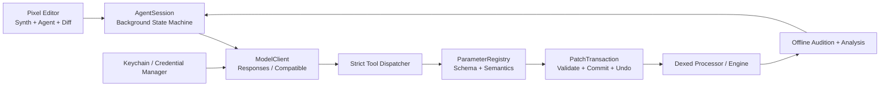

# Agentic Dexed 产品与系统设计

- **状态：** 用户已确认
- **日期：** 2026-10-01
- **目标上游：** `asb2m10/dexed` `master`，调研时 HEAD 为 `2e182b3db85c09083ab13c8b9b00565ce7d9ff85`
- **许可证：** 基于 Dexed 的派生作品继续遵守 GPL-3.0，并保留上游及第三方组件声明

## 1. 产品目标

Agentic Dexed 是 Dexed 的完整可演奏分支。它保留 DX7 音色兼容性和传统手动编辑能力，同时在插件内部提供 Agent harness。用户输入自己的模型服务地址、模型名和 API Key，即可用自然语言创建、修改、分析和保存音色。

首个可交付版本成功时，用户能够：

1. 在 Windows x64 和 macOS Intel/Apple Silicon 的 VST3 宿主中正常加载并演奏插件。
2. 在像素风原生界面中访问 Dexed 的全部音色参数和声音相关状态。
3. 配置自己的 API Key、Base URL 和模型名，测试连接并随时删除凭据。
4. 用自然语言要求 Agent 创建或修改音色，实时看到参数差异并试听结果。
5. 将每轮 AI 修改作为完整事务撤销、重做、保留或继续迭代。
6. 保存音色并继续导入、导出兼容的 DX7 SysEx 数据。
7. 在断网、未配置模型或 Agent 出错时，继续把插件作为完整的 Dexed 合成器使用。

## 2. 首发范围

### 2.1 交付格式

- 产品名为 `Agentic Dexed`，VST3 plugin code 为 `AgDx`，bundle identifier 为 `com.agenticdexed.AgenticDexed`，避免覆盖原版 Dexed 安装。
- Windows 10 22H2 或更高版本的 x64 VST3。
- macOS 11 或更高版本的 x86_64 与 arm64 VST3；发布包使用 Universal Binary，同时包含两种架构。
- Standalone 构建用于开发、Agent 调试、自动化测试和故障诊断。

AU 与 CLAP 不属于首发验收。代码保持 JUCE 跨平台结构，后续可以恢复这些上游格式而无需重写 Agent 或参数层。

### 2.2 模型服务

- OpenAI Responses API。
- OpenAI-compatible Chat Completions，包括用户自定义 Base URL。
- 模型名由用户填写，不在插件中绑定具体模型。
- Provider 接口允许后续新增原生协议适配器。
- 远程请求默认关闭服务端状态保存；对 Responses API 发送 `store: false`。

### 2.3 交互默认值

- Agent 参数事务默认实时应用。
- 每个事务立即显示差异，并提供一键撤销和重做。
- 用户可切换为“确认后应用”；该模式先生成提案，用户确认后才提交。
- 每个用户请求最多进行四轮“修改—试听分析—再修改”自主循环。
- 用户可随时取消生成或试听分析。

## 3. 项目分解

实现分成五个连续、可独立验证的阶段：

1. **上游基础：** 引入固定版本的 Dexed 源码与子模块，建立 Windows/macOS VST3 和 Standalone 构建。
2. **参数领域层：** 建立完整的类型化参数注册表、快照、版本号和可撤销事务。
3. **Agent harness：** 实现模型传输、流式协议、工具循环、凭据存储、试听分析和故障恢复。
4. **像素风编辑器：** 用 JUCE 原生组件重做参数工作区、Agent 面板、差异视图和设置界面。
5. **发布验证：** 完成跨平台 CI、插件验证、宿主冒烟测试、签名与发布包。

这些阶段共享本规格定义的接口和验收标准。实施计划可以按阶段拆分，但不能缩减本规格的最终产品范围。

## 4. 系统架构



### 4.1 组件边界

**ParameterRegistry**

- 是参数 ID、类型、范围、显示规则、语义和底层 Dexed 映射的唯一来源。
- 为 UI、Agent 工具、状态序列化和测试提供同一份元数据。
- 不执行网络、绘制或音频处理。

**SynthStateService**

- 生成一致的参数快照及单调递增的 `revision`。
- 接收已验证事务，并在合适的线程上更新 Dexed 与宿主参数。
- 向 UI 发布状态变化，不在音频线程调用 UI。

**PatchTransactionService**

- 在写入任何值之前验证整个修改集。
- 记录事务 ID、请求来源、修改原因、基准版本和每个参数的前后值。
- 提供条件式撤销/重做；检测到新修改时返回冲突而不是静默覆盖。

**AgentSession**

- 管理提示、流式文本、工具调用、取消、轮次上限和用户可见状态。
- 不直接写 Dexed 内存，只能通过工具分发器调用领域服务。
- 编辑器关闭或插件销毁时取消未完成请求并安全等待后台任务退出。

**ModelClient**

- 通过统一接口隐藏 Responses 和 Chat Completions 的事件差异。
- 支持 Server-Sent Events 流式响应、超时、取消和请求 ID。
- 不保存明文凭据，不把鉴权头写入日志。

**AuditionAnalyzer**

- 在后台使用独立的预览合成实例和固定 MIDI 片段离线渲染。
- 计算响度、峰值、包络、频谱质心、频谱滚降、过零率和静音/异常数值标志。
- 返回紧凑的结构化指标；首发版本不向模型服务上传原始音频。
- 单次试听最多 10 秒，以 48 kHz 双声道 float32 渲染；每个 Agent 任务最多保留一个试听缓冲。

### 4.2 线程约束

- 音频线程不进行网络、JSON、文件、系统凭据、日志格式化、阻塞锁或动态 UI 操作。
- Agent 网络与协议解析运行在专用后台任务上。
- 离线试听使用独立合成实例，不能占用宿主实时处理实例。
- Agent 事务在非音频线程完成验证，并通过无阻塞状态交换在音频块边界可见。
- 已存在的宿主参数变更仍发送规范的 begin/change/end gesture 通知。
- 参数快照与音频状态交换不得让音频线程等待消息线程或后台任务。

## 5. 参数领域模型

### 5.1 覆盖范围

注册表覆盖所有会改变声音、演奏响应或可保存音色内容的可变状态：

- 六个 Operator 的幅度包络、输出、频率模式、粗调、细调、失谐、键位缩放、速率缩放、调幅灵敏度、力度灵敏度和开关。
- Pitch EG、算法、反馈、振荡器同步、LFO、Pitch Mod Sensitivity 和移调。
- 输出增益、滤波截止、滤波共振、主调音与 Mono/Poly。
- Dexed 引擎模式。
- Pitch bend、mod wheel、foot、breath、aftertouch 与 portamento 的声音相关设置。
- 速度归一化和其它会改变演奏响应的处理器设置。
- 音色名称、Operator 开关状态及完整的兼容 SysEx voice 数据。
- SCL/KBM 微调音状态以及恢复标准调音操作；文本输入继续遵守上游 16 KiB 限制。

界面缩放、最近文件、MIDI 设备路径和 Agent 面板布局属于应用偏好，不伪装成合成参数。它们可由设置界面管理，但不交给音色 Agent 修改。

### 5.2 参数描述

每个参数定义至少包含：

- 稳定、层级式 ASCII ID，例如 `operator.1.eg.rate.1`、`global.algorithm`。
- 用户显示名与 Agent 可读说明。
- `integer`、`float`、`boolean`、`enum`、`string` 或命令类型。
- 原始最小值、最大值、步进、默认值、单位和显示转换。
- 枚举值及标签。
- 所属分组、Operator 编号和 DX7 语义标签。
- Dexed voice offset、宿主参数索引或专用访问器。
- 是否可宿主自动化、是否进入 SysEx、是否影响离线试听。

稳定 ID 不使用现有易变的显示标签。已发布 ID 后续只能增加，不能重新解释或复用。

### 5.3 快照和事务

`SynthSnapshot` 包含 `revision`、音色名称、参数值和必要的引擎/调音元数据。Agent 可读取完整快照，也可按分组读取。

`PatchTransaction` 包含：

- 唯一 `transaction_id`。
- `base_revision`。
- 用户目标和模型给出的简短修改原因。
- 一个或多个 `{ parameter_id, value }` 操作。
- `live` 或 `proposed` 应用模式。

提交规则：

1. 拒绝未知 ID、错误类型、非有限浮点数、越界值、重复冲突操作和过期版本。
2. 先验证整个事务；任一操作失败时不改变任何参数。
3. 成功事务只增加一次状态版本号，并保留完整前后值。
4. UI 和宿主只看到合法值；离散值在领域层按定义量化。
5. 撤销是一笔新的条件事务。相关参数在原事务后被手动或自动化修改时，先显示冲突。

## 6. Agent 工具协议

工具使用严格 JSON Schema，所有对象设置 `additionalProperties: false`。Provider 不支持严格模式时仍执行相同的本地运行时验证。

### 6.1 `describe_parameters`

按分组、Operator 或 ID 列表返回参数定义。响应应紧凑，允许 Agent 按需加载语义，避免每轮重复发送全部描述。

### 6.2 `get_synth_state`

返回完整或指定范围的 `SynthSnapshot`。每次写操作前，Agent 必须持有当前 `revision`。

### 6.3 `apply_parameter_patch`

接收 `PatchTransaction`。返回新版本、归一化后的实际值、差异和可读错误。工具调用成功只表示事务已经提交；模型仍需根据试听结果判断是否继续。

### 6.4 `undo_transaction` 与 `redo_transaction`

接收目标事务 ID 和当前基准版本。发生冲突时返回受影响参数及当前值，不自动覆盖。

### 6.5 `audition_patch`

接收测试片段类型、音高、力度和持续时间等有界参数。离线渲染设置硬性时长与内存上限，返回结构化指标及可选的本地 UI 试听缓存句柄。

### 6.6 `name_and_save_patch`

验证 DX7 名称规则，更新当前音色名称并保存到用户选择或已授权的位置。Agent 不能提供任意文件系统路径；实际位置由 UI 文件选择或预先授权的音色库决定。

## 7. Agent 工作流

1. 用户输入声音目标或对当前音色的修改要求。
2. AgentSession 加入紧凑当前快照、系统规则和工具定义。
3. 模型按需读取参数说明和更小范围的状态。
4. 模型提交带原因的参数事务。
5. 插件验证并按当前应用模式实时提交或展示提案。
6. Agent 请求离线试听分析，比较目标与测量结果。
7. Agent 可继续修改，总自主轮数最多四轮。
8. Agent 用简短语言说明修改、关键听感和建议的下一步试听。
9. 用户保留、撤销、继续描述或保存音色。

系统提示要求 Agent：

- 只通过注册工具读取和修改状态。
- 优先进行音乐上连贯的小组修改，说明关键取舍。
- 不编造参数 ID、范围、已听到的主观音色或不存在的分析结果。
- 在目标含糊时先作可试听的合理版本，再用一个具体听感问题继续迭代。
- 看到版本冲突、静音、NaN、削波或工具错误时停止盲目迭代并解释原因。

## 8. 模型传输与凭据

### 8.1 配置

用户配置包括 Provider 协议、Base URL、模型名、请求超时和 API Key。Base URL 与模型名保存在用户级偏好中；它们不进入 DAW 工程状态。API Key 只存入系统凭据服务：

- Windows：Credential Manager 的 `CRED_TYPE_GENERIC`。
- macOS：Keychain Services 的通用密码项。

读取和写入凭据均在后台完成。插件内提供“测试连接”“替换密钥”和“忘记密钥”。若系统凭据服务不可用，插件允许仅在当前进程内临时使用密钥，并明确显示不会持久化。

### 8.2 网络规则

- 远程地址要求 HTTPS；明文 HTTP 仅允许 loopback 地址以支持本地模型服务。
- TLS 证书验证默认开启且不可静默绕过。
- 重定向到不同主机时不转发鉴权头。
- 连接超时为 10 秒，单次模型响应超时为 120 秒，最多跟随 3 次同主机重定向。
- 单个序列化请求体上限为 256 KiB，累计响应上限为 4 MiB，单个 SSE 事件上限为 1 MiB。
- 每个用户任务最多四轮 Agent 工具循环；达到上限后返回当前结果并等待用户继续。
- 仅对尚未产生副作用的幂等网络步骤自动退避重试，最多重试 2 次，间隔为 500 ms 和 1500 ms。
- 日志记录 Provider、状态码、耗时和请求 ID；移除鉴权头、API Key、用户提示及完整响应正文。

### 8.3 隐私

发送给模型的内容包括用户提示、参数定义、当前参数值、工具结果和离线音频指标。首发版本不上传原始音频、MIDI 文件、DAW 工程内容或本地文件。Agent 对话仅存在于当前插件实例内，可由用户显式导出；它不进入宿主 preset/state，也不自动写入磁盘。

## 9. 像素风界面

### 9.1 布局

基准画布为 1280 × 760，采用可缩放的 JUCE 原生组件：

```text
┌──────────────────────────────────────────────────────────────────────┐
│ PATCH / ENGINE / STATUS             UNDO  REDO  SAVE  AGENT SETTINGS │
├──────────────────────────────────────────────┬───────────────────────┤
│ ALGORITHM ROUTING       GLOBAL / PITCH / LFO │ AGENT CONSOLE         │
│ ┌──────────────┐       ┌───────────────────┐ │ conversation/stream   │
│ │ operator map │       │ envelopes/effects │ │                       │
│ └──────────────┘       └───────────────────┘ │ CHANGE SET            │
│                                              │ OP1 LEVEL  72 -> 88    │
│ ┌──────────┐ ┌──────────┐ ┌──────────┐      │ ALGORITHM   5 -> 14    │
│ │ OP 1     │ │ OP 2     │ │ OP 3     │      │                       │
│ ├──────────┤ ├──────────┤ ├──────────┤      │ UNDO / KEEP           │
│ │ OP 4     │ │ OP 5     │ │ OP 6     │      │                       │
│ └──────────┘ └──────────┘ └──────────┘      │                       │
├──────────────────────────────────────────────┴───────────────────────┤
│ COLLAPSIBLE KEYBOARD / OUTPUT / SPECTRUM / AUDITION                 │
└──────────────────────────────────────────────────────────────────────┘
```

Agent 面板可折叠；折叠后合成器编辑区使用完整宽度。键盘同样可折叠。最小可用尺寸仍能访问全部功能，较小窗口通过分组分页而不是压缩文字。

最小窗口为 960 × 640；预设缩放比例为 100%、125%、150% 和 200%。窗口尺寸与缩放属于用户级偏好，不进入 DAW 工程状态。

### 9.2 视觉语言

- 黑色与深蓝硬件底板。
- 青蓝表示普通交互与信号，琥珀表示 Agent 新修改，红色只表示错误或削波。
- 标题和短数值使用打包的像素字体；长对话使用高可读等宽字体。
- 组件、图标和边框以 8 px 基本网格设计，并在缩放后对齐设备像素。
- 算法视图明确区分载波和调制器；选择 Operator 时同步突出连线和卡片。
- 颜色之外同时使用角标、描边、图标和文字表达状态。
- 动画短且可关闭；Reduced Motion 设置关闭非必要动画。

### 9.3 差异与控制

- AI 修改过的控件显示旧值、当前值和简短原因。
- Agent 面板同时显示流式文本、工具活动、轮次和事务状态。
- 参数仍可由鼠标、键盘、MIDI 和 DAW 自动化直接编辑。
- 手动修改会立即更新快照版本，并在 Agent 仍工作时触发冲突处理。
- 设置页永不回显完整 API Key。

## 10. 状态持久化

DAW 工程与插件 preset 保存完整合成器状态、当前音色、引擎模式和兼容所需数据。它们不包含 API Key、对话记录、网络请求或系统凭据标识之外的秘密。

用户级偏好保存非秘密的模型配置、应用模式、界面布局、缩放和动画设置。凭据服务中的记录使用稳定产品服务名和 Provider 标识，以便替换或删除而不会枚举其它应用凭据。

加载旧 Dexed 状态时使用兼容迁移路径补齐新增字段；保存出的 DX7 SysEx 继续只包含兼容 voice 数据，不混入 Agent 元数据。

## 11. 错误处理

- 缺少密钥、鉴权失败、模型不存在、限流、超时、TLS 错误和取消均映射为用户可行动的状态。
- SSE 中断保留已经收到的文字，但不执行不完整工具调用。
- JSON 或工具参数不合法时返回结构化错误给模型；连续两次协议错误后结束该请求。
- 未知参数、越界值、非有限值和过期版本永远不能改变合成器状态。
- 离线试听超时、无声、NaN 或异常峰值时终止自主迭代并保留最后一笔合法事务供用户撤销。
- 插件销毁时先取消请求，再释放 Agent 资源；任何回调都通过弱生命周期句柄进入 UI。
- Agent 失败不会阻止音频处理、手动编辑、preset 或 SysEx 功能。

## 12. 验证策略

### 12.1 单元测试

- 注册表 ID 唯一、稳定，类型与范围正确，并覆盖所有声音相关 Dexed 状态。
- 每个宿主参数可映射到一个注册项，每个兼容 voice 字段可往返读写。
- SysEx 导入—修改—导出保持格式、校验和和未修改字段。
- 事务验证全有或全无、版本冲突、量化、撤销、重做和宿主通知。
- Responses 与 Chat Completions 事件解析使用固定 JSON/SSE fixture。
- 严格工具验证覆盖未知字段、缺失字段、超大请求、重复调用和无效数值。
- 系统凭据接口使用平台实现测试和可注入的内存 fake。
- 试听分析覆盖正常输出、静音、削波、NaN、时长上限和取消。

### 12.2 集成测试

- 模拟 HTTP 服务验证连接测试、流式输出、多轮工具调用、限流、超时、断线和取消。
- 幂等事务 ID 证明重试不会重复应用参数。
- 关闭编辑器或销毁插件时，未完成请求不会产生悬空回调。
- Agent 修改与同时发生的 UI、MIDI 和宿主自动化产生明确版本冲突。
- 实时监测或测试钩子证明音频回调未执行网络、文件 I/O 或阻塞锁等待。

### 12.3 音频与 UI 测试

- 固定音色和 MIDI 片段的离线特征在跨平台容差内稳定。
- 每笔测试修改产生预期方向的音频特征变化，且没有静音、NaN 或异常峰值。
- 基准尺寸、最小尺寸及常用缩放比例进行截图比较。
- 键盘导航、焦点、对比度、Reduced Motion 和非颜色状态提示进行人工检查。

### 12.4 构建与宿主验证

- Windows 使用 Visual Studio 2022/CMake 构建 VST3 与 Standalone。
- macOS CI 构建 x86_64、arm64 和 Universal VST3/Standalone。
- 两个平台运行 JUCE 测试、VST3 Validator 或 pluginval。
- 使用 REAPER 7 在 Windows 与 macOS 完成加载、保存工程、恢复、自动化、Agent 修改和卸载冒烟测试；其它可用宿主作为补充证据。
- 发布流水线支持 Windows 代码签名和 macOS 签名、公证；开发构建允许无签名，公开发布包必须完成对应平台签名。

## 13. 首发验收标准

首发候选只有在以下条件全部有证据时通过：

1. Windows 与 macOS VST3 可构建、加载、演奏并恢复工程状态。
2. 完整参数覆盖测试通过，没有未注册的声音相关可变状态。
3. OpenAI Responses 与兼容 Chat Completions 的模拟及真实连接测试通过。
4. API Key 未出现在 preset、DAW 工程、普通配置、日志或崩溃诊断文本中。
5. Agent 能完成至少三类端到端任务：从初始化音色创建目标音色、修改现有音色、分析并修复静音或削波音色。
6. 每次 Agent 修改可查看差异并撤销/重做，冲突不会静默覆盖用户修改。
7. SysEx 往返、离线试听、音频线程约束、插件验证和 UI 截图测试通过。
8. 像素风 UI 的所有核心功能在 Agent 面板展开和折叠状态都可访问。
9. 原版 Dexed 的演奏、cartridge、SysEx、微调音、MIDI 映射和手动参数编辑工作流仍然可用。

## 14. 参考依据

- Dexed 上游：<https://github.com/asb2m10/dexed>
- OpenAI Responses API：<https://developers.openai.com/api/docs/guides/migrate-to-responses>
- OpenAI Function Calling：<https://developers.openai.com/api/docs/guides/function-calling>
- Windows Credential Manager：<https://learn.microsoft.com/en-us/windows/win32/api/wincred/nf-wincred-credwritew>
- Apple Keychain Services：<https://developer.apple.com/documentation/security/keychain-services/>
